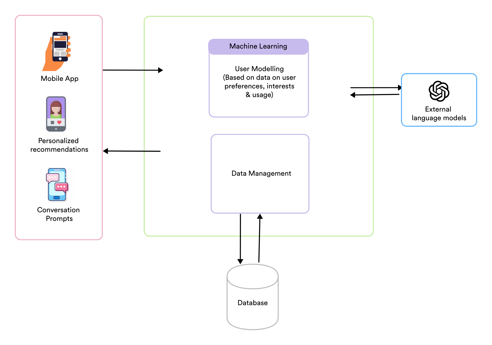

# Wingman

Wingman is an adaptive dating mobile application that assists users in finding the best potential match based on their characteristics. The app uses machine learning algorithms to learn more about users through their inputs, which it then uses to recommend profiles to the user. In addition, the app uses a large language model(OpenAI GPT model) to generate icebreaker questions or jokes based on the matched partner's bio to ease conversation starters.

## Architecture

The architecture of the application comprises three primary layers - presentation layer, business layer, and data layer. The presentation layer deals with the user's interactions with the application. The business layer performs user modeling based on user data, manages the user data, performs topic modeling to extract topics from the user's bio, and connects with external language model APIs for personalized conversational suggestion. The data layer stores the user data. Figure 3 depicts our technology stack, and we discuss the technology stack used in each layer in more detail in the subsequent sections. We will also delve into the implementation of the external language API in the Implementation section of this report. 

  

## Implementation

### Backend Functionality

The backend is a Flask application that stores user profiles in a database. Users can register, login, update their profiles, and swipe right or left on other users. The application retrieves and sends data to the database using SQLAlchemy and Pandas.

The API endpoints include:

| Method | Endpoint | Description |
| --- | --- | --- |
| POST | /register | Register a new user |
| POST | /login | Log in a user |
| POST | /logout | Log out a user |
| GET | /all-users | Retrieve all users |
| GET | /user/<user_id> | Retrieve a specific user |
| GET | /get-similar-users/<user_id> | Retrieve similar users based on a user's characteristics |
| GET | /get-ice-breakers/<user_id> | Retrieve icebreaker questions based on a user's characteristics |
| PUT | /update-user | Update a user's profile |
| POST | /add-swipe | Add a swipe to a user's profile |
| GET | /matches/<user_id> | Retrieve a user's matches |

### User Sign-up/Login/Logout

For user authentication, JWT (JSON Web Token) is used. A token is issued to users upon login or registration, and a valid token is required to access protected endpoints.

### Content-based Profile Recommendations

One of the key functionalities of the backend is to create a list of users to recommend to a specific user. The /get-similar-users functionality takes a Pandas DataFrame and an ID representing a user's ID and uses K-Means clustering to find similar users based on their age, diet, drinks, and orientation. The categorical features are encoded to numerical features using LabelEncoder, and the features are then scaled using StandardScaler. The features are clustered into three clusters using KMeans, and the cluster label for the user with the given ID is obtained using kmeans.predict(). Based on the user's orientation and sex, the code filters the DataFrame to find similar users with the same cluster label and returns a DataFrame of similar users.

### Icebreaker Recommendations

For generating icebreaker conversation starters, the backend utilises two key modules, a topic modelling module and an ice breaker generator module. The topic modelling uses Latent Dirichlet Allocation (LDA) to extract the dominant topics from the user's bio. These topics are then passed along to the ice breaker generator module, which creates a prompt asking for three brief icebreakers based on those topics and then sends that prompt to OpenAI API. The app uses the GPT-3.5 Turbo model to generate icebreakers, and if it is unavailable or fails to generate icebreakers, a fallback message with three default icebreakers is returned. The generated icebreakers are then returned as a list for use in the app.

## Getting Started

Install all the required libraries using the command inside the project directory

`pip install -r requirements.txt`

To run the flask app, use either 

`python app.py`

or

`flask run`

## Contributors
- Yatin Mohan Vaid (@yatinmv)
- Bríd O'Donnell (@bod777)
- Varshini Suresh (@sureshvarshini)
- Arnav Bhattacharya (@KaalaAadmi)
- Feng Wang (@WangFeng12345678)

